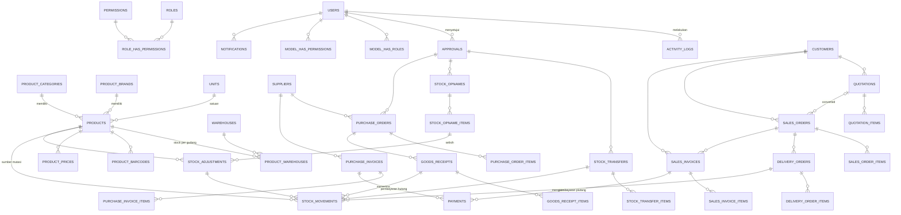

# Database ERD

## Ringkasan Tabel Utama

| Tabel | Tujuan |
|-------|--------|
| product_warehouses | Saldo stok per produk per gudang (qty_on_hand) |
| stock_movements | Ledger mutasi stok (in/out) dengan reference_type |
| quotations / quotation_items | Dokumen penawaran |
| sales_orders / sales_order_items | Pesanan penjualan |
| delivery_orders / delivery_order_items | Pengiriman barang |
| sales_invoices / sales_invoice_items | Faktur penjualan |
| purchase_orders / purchase_order_items | Pesanan pembelian |
| goods_receipts / goods_receipt_items | Penerimaan barang |
| purchase_invoices / purchase_invoice_items | Faktur pembelian |
| payments | Pembayaran (polymorphic payable: sales/purchase invoice) |
| stock_adjustments | Penyesuaian stok |
| stock_transfers / stock_transfer_items | Transfer antar gudang |
| stock_opnames / stock_opname_items | Stock opname |
| approvals | Approval log (polymorphic approvable) |
| activity_logs | Audit trail semua aksi |
