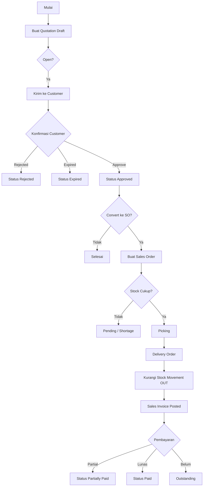
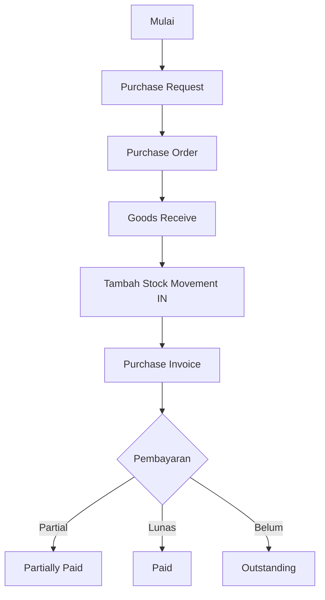
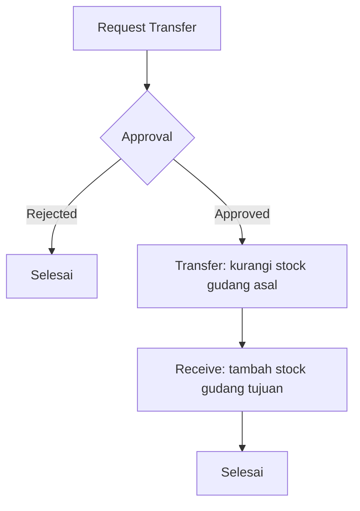
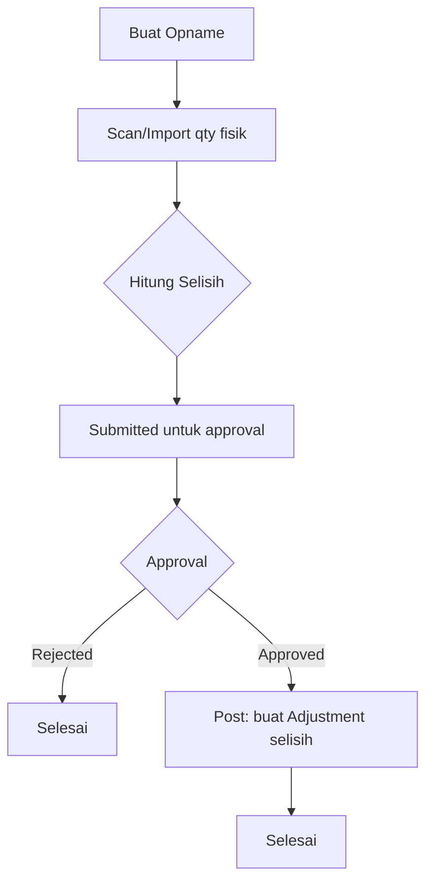
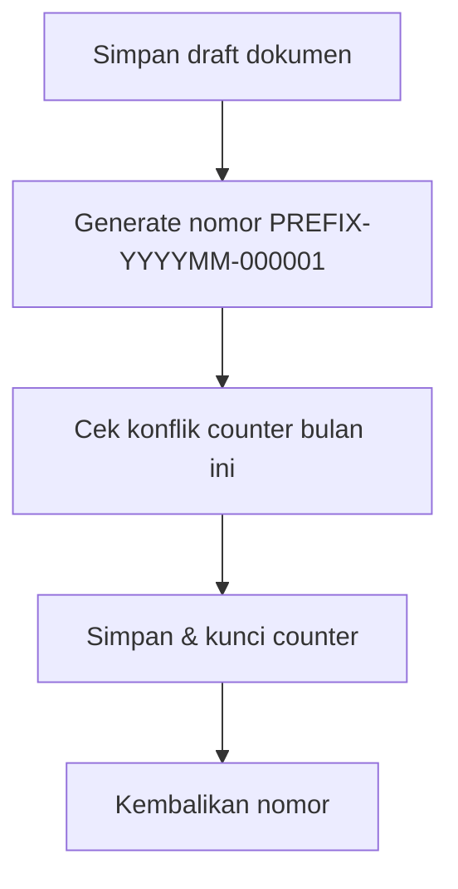

# Flowchart

## F1. Alur Penjualan (Quotation → Payment)

```mermaid
flowchart TD
    A[Mulai] --> B[Buat Quotation Draft]
    B --> C{Open?}
    C -- Ya --> D[Kirim ke Customer]
    D --> E{Konfirmasi Customer}
    E -- Rejected --> F[Status Rejected]
    E -- Expired --> G[Status Expired]
    E -- Approve --> H[Status Approved]
    H --> I{Convert ke SO?}
    I -- Tidak --> J[Selesai]
    I -- Ya --> K[Buat Sales Order]
    K --> L{Stock Cukup?}
    L -- Tidak --> M[Pending / Shortage]
    L -- Ya --> N[Picking]
    N --> O[Delivery Order]
    O --> P[Kurangi Stock Movement OUT]
    P --> Q[Sales Invoice Posted]
    Q --> R{Pembayaran}
    R -- Partial --> S[Status Partially Paid]
    R -- Lunas --> T[Status Paid]
    R -- Belum --> U[Outstanding]
```

## F2. Alur Pembelian (PR → Payment)

```mermaid
flowchart TD
    A[Mulai] --> B[Purchase Request]
    B --> C[Purchase Order]
    C --> D[Goods Receive]
    D --> E[Tambah Stock Movement IN]
    E --> F[Purchase Invoice]
    F --> G{Pembayaran}
    G -- Partial --> H[Partially Paid]
    G -- Lunas --> I[Paid]
    G -- Belum --> J[Outstanding]
```

## F3. Stock Transfer

```mermaid
flowchart TD
    A[Request Transfer] --> B{Approval}
    B -- Rejected --> C[Selesai]
    B -- Approved --> D[Transfer: kurangi stock gudang asal]
    D --> E[Receive: tambah stock gudang tujuan]
    E --> F[Selesai]
```

## F4. Stock Opname

```mermaid
flowchart TD
    A[Buat Opname] --> B[Scan/Import qty fisik]
    B --> C{Hitung Selisih}
    C --> D[Submitted untuk approval]
    D --> E{Approval}
    E -- Rejected --> F[Selesai]
    E -- Approved --> G[Post: buat Adjustment selisih]
    G --> H[Selesai]
```

## F5. Proses Numerisasi

```mermaid
flowchart TD
    A[Simpan draft dokumen] --> B[Generate nomor PREFIX-YYYYMM-000001]
    B --> C[Cek konflik counter bulan ini]
    C --> D[Simpan & kunci counter]
    D --> E[Kembalikan nomor]
```
