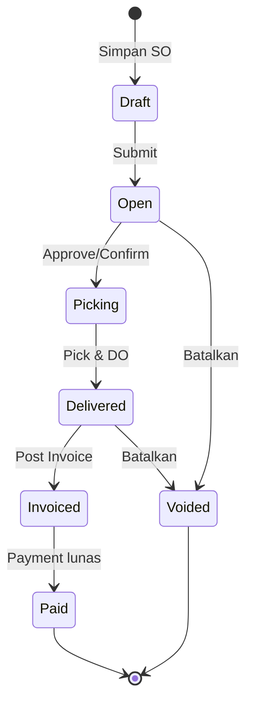
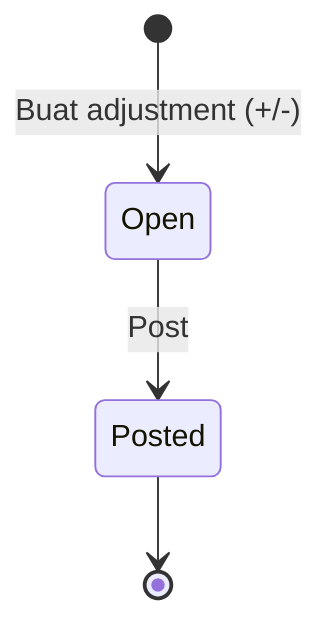
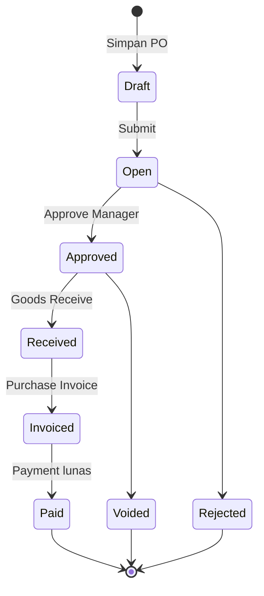
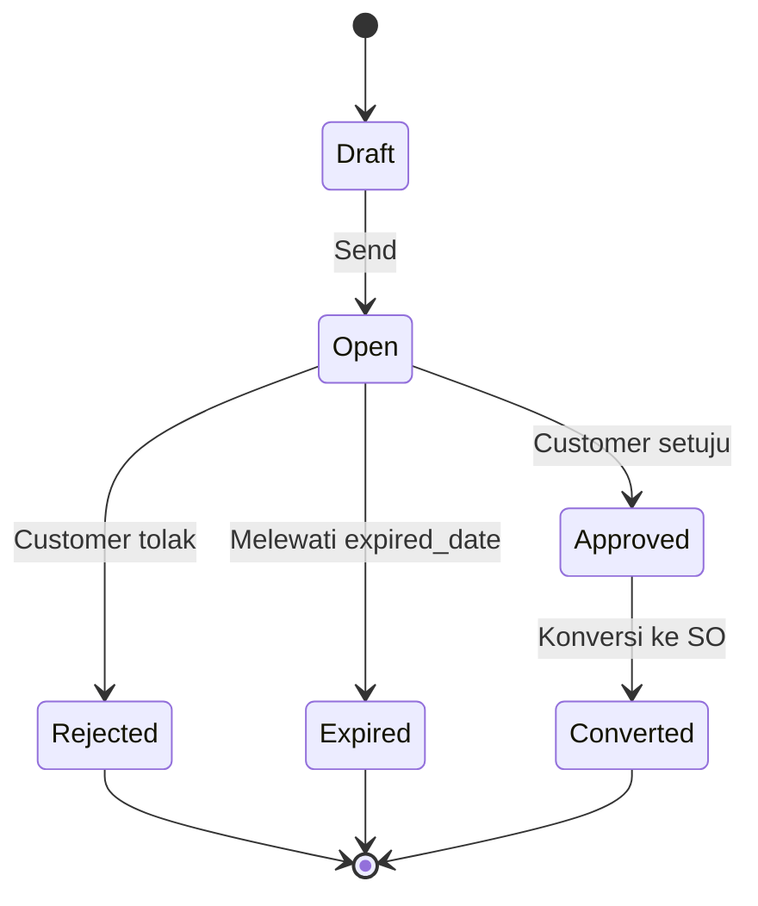

# Activity Diagram

## A1. Create & Post Sales Order

```mermaid
stateDiagram-v2
    [*] --> Draft : Simpan SO
    Draft --> Open : Submit
    Open --> Picking : Approve/Confirm
    Picking --> Delivered : Pick & DO
    Delivered --> Invoiced : Post Invoice
    Invoiced --> Paid : Payment lunas
    Open --> Voided : Batalkan
    Delivered --> Voided : Batalkan
    Paid --> [*]
    Voided --> [*]
```

## A2. Stock Adjustment

```mermaid
stateDiagram-v2
    [*] --> Open : Buat adjustment (+/-)
    Open --> Posted : Post
    Posted --> [*]
```

## A3. Purchase Order

```mermaid
stateDiagram-v2
    [*] --> Draft : Simpan PO
    Draft --> Open : Submit
    Open --> Approved : Approve Manager
    Approved --> Received : Goods Receive
    Received --> Invoiced : Purchase Invoice
    Invoiced --> Paid : Payment lunas
    Open --> Rejected
    Approved --> Voided
    Paid --> [*]
    Rejected --> [*]
    Voided --> [*]
```

## A4. Quotation Lifecycle

```mermaid
stateDiagram-v2
    [*] --> Draft
    Draft --> Open : Send
    Open --> Approved : Customer setuju
    Open --> Rejected : Customer tolak
    Open --> Expired : Melewati expired_date
    Approved --> Converted : Konversi ke SO
    Rejected --> [*]
    Expired --> [*]
    Converted --> [*]
```
