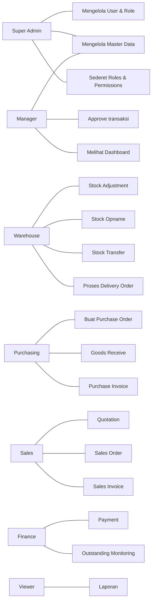

# Use Case Diagram

## Detail Use Case Penting

| UC | Actor | Deskripsi |
|----|-------|-----------|
| UC-01 | Sales | Membuat quotation dari draft, menambah item, submit ke open |
| UC-02 | Sales/Manager | Convert quotation ter-approve menjadi Sales Order |
| UC-03 | Sales | Membuat SO manual, input item, qty, harga, diskon, pajak |
| UC-04 | Warehouse | Melakukan picking & membuat Delivery Order |
| UC-05 | Finance | Membuat Sales Invoice dari SO, mencatat partial payment |
| UC-06 | Purchasing | Membuat PO dari PR, memantau status penerimaan |
| UC-07 | Warehouse | Menerima barang (GRN), sistem menambah stok |
| UC-08 | Warehouse | Melakukan stock opname dengan scan/import |
| UC-09 | Manager | Menyetujui/menolak stock transfer, opname, PO |
| UC-10 | All | Membaca laporan & melihat notifikasi |
