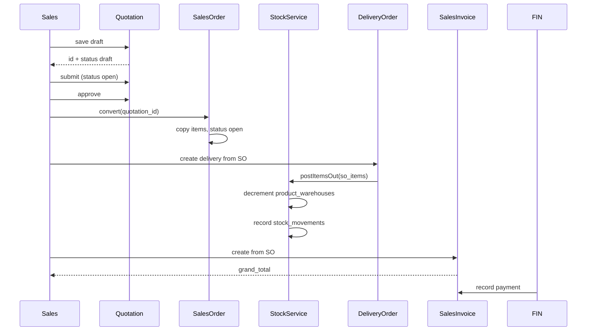
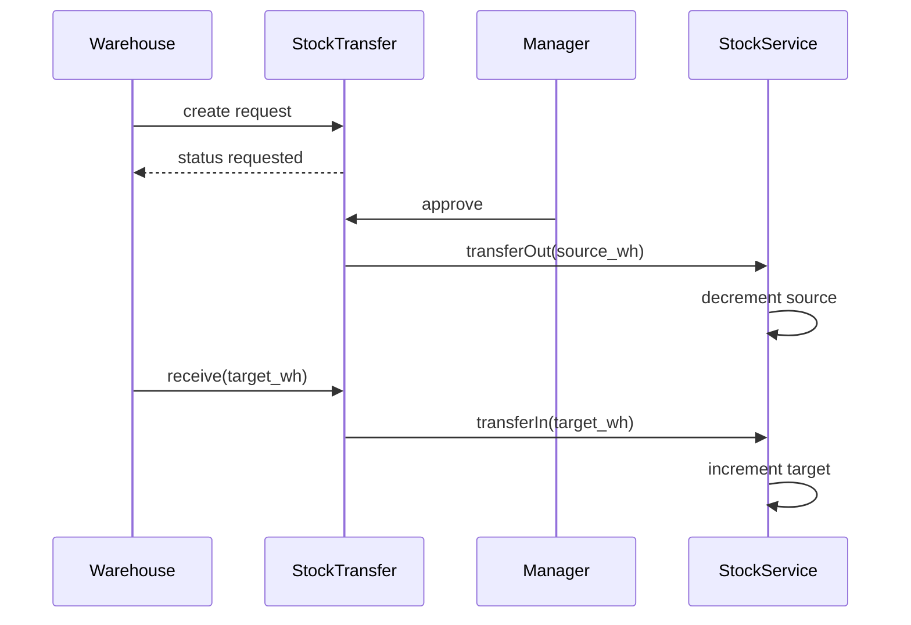
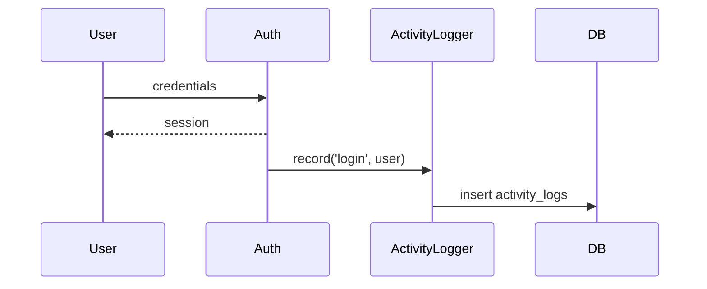
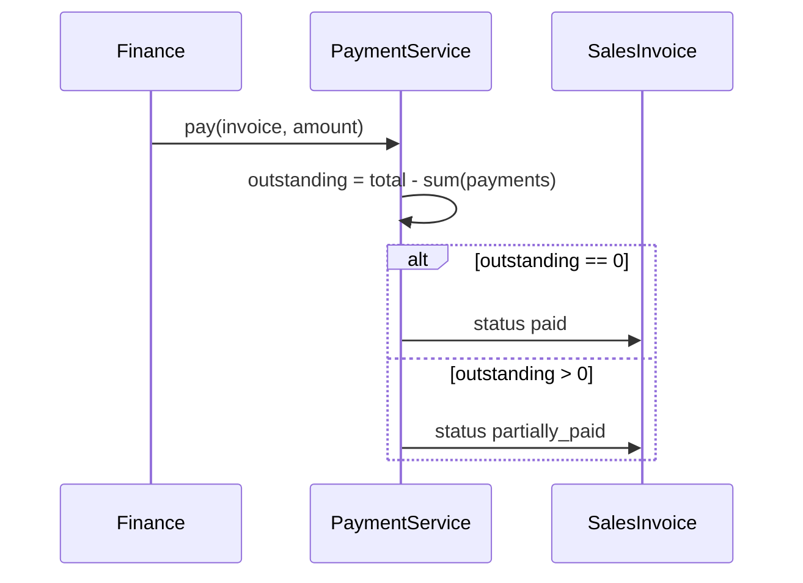

# Sequence Diagram

## S1. Convert Quotation → SO → DO → Invoice

```mermaid
sequenceDiagram
    participant S as Sales
    participant Q as Quotation
    participant SO as SalesOrder
    participant IV as StockService
    participant DO as DeliveryOrder
    participant INV as SalesInvoice

    S->>Q: save draft
    Q-->>S: id + status draft
    S->>Q: submit (status open)
    S->>Q: approve
    S->>SO: convert(quotation_id)
    SO->>SO: copy items, status open
    S->>DO: create delivery from SO
    DO->>IV: postItemsOut(so_items)
    IV->>IV: decrement product_warehouses
    IV->>IV: record stock_movements
    S->>INV: create from SO
    INV-->>S: grand_total
    FIN->>INV: record payment
```

## S2. Approval Stock Transfer

```mermaid
sequenceDiagram
    participant W as Warehouse
    participant T as StockTransfer
    participant M as Manager
    participant IV as StockService

    W->>T: create request
    T-->>W: status requested
    M->>T: approve
    T->>IV: transferOut(source_wh)
    IV->>IV: decrement source
    W->>T: receive(target_wh)
    T->>IV: transferIn(target_wh)
    IV->>IV: increment target
```

## S3. Login & Audit

```mermaid
sequenceDiagram
    participant U as User
    participant Auth
    participant Log as ActivityLogger
    participant DB

    U->>Auth: credentials
    Auth-->>U: session
    Auth->>Log: record('login', user)
    Log->>DB: insert activity_logs
```

## S4. Payment Partial / Lunas

```mermaid
sequenceDiagram
    participant F as Finance
    participant P as PaymentService
    participant INV as SalesInvoice

    F->>P: pay(invoice, amount)
    P->>P: outstanding = total - sum(payments)
    alt outstanding == 0
        P->>INV: status paid
    else outstanding > 0
        P->>INV: status partially_paid
    end
```
